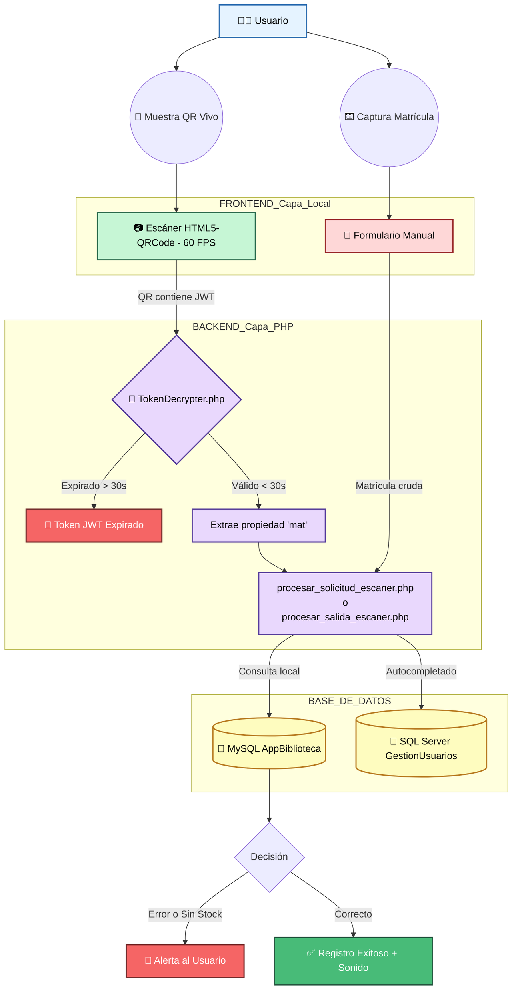

## 💚 AppBiblioteca UTTN - Guía Técnica de Actualización

Este documento detalla los cambios estructurales e implementaciones funcionales realizadas durante la reciente actualización del sistema AppBiblioteca. El objetivo principal de esta versión fue automatizar el proceso de captura de usuarios y fortalecer la seguridad en la validación de credenciales digitales.

--------------------------------------------------------------------------------

## 📂 Archivos y Estructura del Proyecto

**Nuevos Archivos Creados:**
- `procesar_solicitud_escaner.php` *(Nuevo manejador de entrada vía cámara)*
- `procesar_salida_escaner.php` *(Nuevo manejador de salida vía cámara)*

**Archivos Modificados Múltiples Veces:**
- `solicitud_servicio.php` *(UI Principal: Cámara y Manual integrados)*
- `registro_salida.php` *(UI Principal: Cámara y Manual integrados)*
- `src/TokenDecrypter.php` *(Lógica central de JWT reescrita y asegurada)*
- `api.php` *(Refactorización extensa para usar sentencias SQL directas en lugar de Stored Procedures)*

--------------------------------------------------------------------------------

## 💀 Diagrama de Flujo del Sistema

El siguiente diagrama explica cómo funciona internamente todo el sistema desde el momento en el que el alumno/docente presenta su credencial digital, hasta que la biblioteca aprueba la entrada o la salida:

--------------------------------------------------------------------------------

## 💀 1. Implementación de Escáner por Cámara Integrada
El proceso de captura de matrículas evolucionó de una entrada estrictamente manual a un escaneo automatizado en tiempo real.

- Se integró la librería `html5-qrcode` para procesar el flujo de video directamente desde la cámara web (o cámara nativa en dispositivos móviles) usando tecnologías Canvas y WebRTC.

- El algoritmo de escaneo opera a 60 FPS, permitiendo una detección casi instantánea del código QR.

- Se implementó un cooldown de 1 segundo tras las lecturas fallidas para optimizar el uso de recursos del equipo y prevenir saturación de peticiones.

--------------------------------------------------------------------------------

## 💀 2. Rediseño y Consolidación de Interfaz de Usuario
Se optimizó el diseño estructural de las pantallas de Entradas (`solicitud_servicio.php`) y Salidas (`registro_salida.php`), unificando las opciones de captura en una sola vista para evitar redundancias de navegación.

- **Distribución estructural en dos columnas:** 
  - La columna izquierda expone permanentemente el flujo de video en vivo de la cámara, incluyendo guías visuales para facilitar el encuadre óptimo de la credencial QR por parte del alumno.

  - La columna derecha mantiene permanentemente disponible el formulario de captura manual clásico, funcionando como un método de respaldo seguro.

- **Experiencia de Usuario (Feedback Visual):** Tras validar correctamente un código, el sistema notifica visualmente el éxito de la petición reproduciendo un evento de audio y bloqueando la interfaz durante 3 segundos antes de restablecer el formulario automáticamente para la siguiente lectura.

--------------------------------------------------------------------------------

## 💀 3. Decodificación Estricta y Seguridad JWT
El componente backend fue adaptado sustancialmente para establecer compatibilidad con la arquitectura de credenciales digitales emitidas por la aplicación secundaria `UTTN_credencial`.

- El controlador PHP de validación (`TokenDecrypter.php`) detecta y abre automáticamente la estructura de los **JSON Web Tokens (JWT)** dinámicos integrados en el código QR del usuario.

- Extrae la Matrícula del usuario utilizando los identificadores internos estándar de la institución (`"mat"` o `"emp"`), reemplazando los esquemas anteriores.

- **Seguridad contra Suplantación:** El sistema evalúa obligatoriamente la propiedad de expiración (`exp`) del *Payload* dentro del JWT. Para mitigar falsificaciones mediante fotografías o capturas de pantalla, cualquier código escaneado con una antigüedad de creación superior a 30 segundos es catalogado como inválido, requiriendo un código digital de sesión actual.

--------------------------------------------------------------------------------

## 💀 4. Estructura de Backend
- La lógica del cliente (autocarga en variables de input, control de foco cruzado, y peticiones AJAX) se unificó en scripts modulares al pie de las vistas base, reduciendo vulnerabilidades.

- **Autocompletado y Obtención de Especialidad:** Se corrigió un error en el script AJAX que impedía recuperar la "Carrera" (o especialidad) del alumno. Ahora, al teclear manualmente la matrícula en el panel derecho, el sistema interroga a la base de datos externa y autocompleta con precisión tanto el nombre completo del estudiante como su especialidad en tiempo real.

- **Refactorización de `api.php` (Eliminación de Procedimientos Almacenados):** Se actualizaron las peticiones internas hacia la base de datos local reemplazando las invocaciones a "Stored Procedures" (`CALL`) por consultas SQL directas. Esto solucionó fallos de compatibilidad con la estructura actual de la base de datos y garantiza que las consultas de usuarios se ejecuten limpiamente.

- Las consultas hacia la base de datos distribuida en SQL Server (`GestionUsuarios`) continúan realizando el mapeo lógico apoyándose de los datos dinámicos extraídos por el módulo decodificador, permitiendo búsquedas de entidades académicas duales (Alumnos y Docentes) de manera eficiente.

--------------------------------------------------------------------------------

## 💀 5. Integridad de Datos y Administrativos
Se añadieron estas tres reglas principales para que el sistema no se caiga ni se llene de datos basura:

- **Búsqueda Inteligente (Mayúsculas Automáticas):** La base de datos escolar de SQL Server es muy estricta y solo acepta matrículas en mayúsculas. Para evitar que te marque "Usuario no encontrado" si alguien escribe su matrícula en minúsculas, el sistema atrapa lo que escribes y lo convierte en automático a mayúsculas perfectas antes de buscarlo.

- **Bloqueo de Doble Entrada:** El sistema no dejar entrar a quien ya está adentro. Si registras a un alumno con el escáner o a mano, y esa persona intenta volver a registrar otra entrada sin haber registrado su salida primero, el sistema lanza la alerta `"Ya existe una solicitud pendiente de salida"` y detiene la acción para que no se dupliquen las visitas en la pantalla principal.

- **Nuevas Pantallas para los Bibliotecarios:** La pantalla unificada que se hizo para los alumnos (donde ves la cámara a la izquierda y el formulario a la derecha), se copió y pegó exactamente igual para crear `solicitud_servicio_admin.php` y `registro_salida_admin.php`. Así los bibliotecarios al iniciar sesión también podrán disfrutar del mismo escáner sin perder las medidas de seguridad administrativas.
